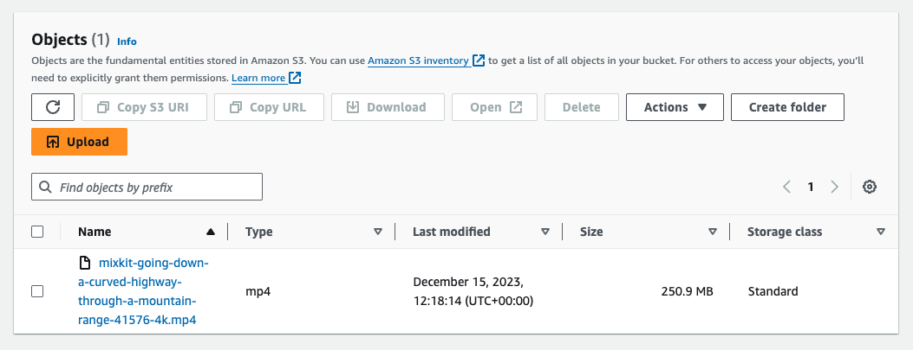

# Multipart upload

No tf scripts are available for that module.
Multipart upload is performed on existing s3 bucket with aws cli (user or role)

## Pre-requisites

- As a prequiste set the env file. Default Region is `eu-west-2`.
- Bucket, KMS Key, User must be created, Policy & Role are additional (sts:AssumeRole)
- content must be bigger than 5MiB, add it to the repo
- set your .env file
- Permissions/Policies:

### multipart user policy

```json
// mpart-user-policy.json
{
  "Version": "2012-10-17",
  "Statement": [
    {
      "Sid": "kmsAndMultipartUpload",
      "Effect": "Allow",
      "Action": [
        "s3:ListBucketMultipartUploads",
        "kms:Decrypt",
        "s3:GetObjectVersionTagging",
        "s3:ListBucket",
        "s3:GetBucketVersioning",
        "s3:ListMultipartUploadParts",
        "s3:PutObject",
        "s3:GetObject",
        "s3:AbortMultipartUpload",
        "kms:Encrypt",
        "s3:GetObjectVersionAcl",
        "kms:GenerateDataKey",
        "s3:GetObjectTagging",
        "kms:DescribeKey",
        "s3:GetObjectVersion"
      ],
      "Resource": [
        "arn:aws:s3:::<aws_s3_bucket>",
        "arn:aws:s3:::<aws_s3_bucket>/*",
        "arn:aws:kms:eu-west-2:<account>:key/<kms_key>"
      ]
    }
  ]
}
```

### kms key

_(Shortened policy for brevity)_

```json
{
            "Sid": "Allow use of the key",
            "Effect": "Allow",
            "Principal": {
                "AWS": [
                    "arn:aws:iam::<account>:user/<aws_user>"
                ]
            },
            "Action": [
                "kms:Encrypt",
                "kms:Decrypt",
                "kms:ReEncrypt*",
                "kms:GenerateDataKey*",
                "kms:DescribeKey"
            ],
            "Resource": "*"
        },
```

### Bucket

```json
{
  "Version": "2012-10-17",
  "Statement": [
    {
      "Sid": "BucketForUser",
      "Effect": "Allow",
      "Principal": {
        "AWS": "arn:aws:iam::<account>:user/<aws_user>"
      },
      "Action": [
        "s3:PutObject",
        "s3:ListBucketMultipartUploads",
        "s3:ListMultipartUploadParts",
        "s3:GetObject",
        "s3:AbortMultipartUpload",
        "s3:GetBucketTagging",
        "s3:PutObjectTagging"
      ],
      "Resource": [
        "arn:aws:s3:::<aws_s3_bucket>",
        "arn:aws:s3:::<aws_s3_bucket>/*"
      ]
    }
  ]
}
```

## Does not include

### sts:AssumeRole

Script currently performed by a user and does not include `sts:AssumeRole` permissions - CLI is used as POC.

### Changes for sts:AssumeRole

For assumed role do the following steps:

- user has been created or your existing user (e.g. `MultipartUser`), has `sts:AssumeRole` policy attached and profile set in the cli as `multipart-profile`:

`aws iam create-user --user-name MultipartUser`
`aws iam create-access-key --user-name MultipartUser`
`aws configure --profile multipart-profile`

- Add trust relationship to a role so it can be assumed:

```json
// trust-policy.json
// trust relationship policy for multipart user
// can be set on user basis
{
  "Version": "2012-10-17",
  "Statement": {
    "Effect": "Allow",
    "Principal": {
      "AWS": "<aws_account>"
    },
    "Action": "sts:AssumeRole"
  }
}
```

- Existing `mpart-user-policy.json` policy is reused and to be attached to user, add `sts:AssumeRole` permission.
- Create a role and attach the trust relationship the existing policy so user can assume it:

`aws iam create-role --role-name multipart-role --assume-role-policy-document file://trust-policy.json`

`aws iam attach-role-policy --role-name multipart-role --policy-arn "arn:aws:iam::<aws_account>:policy/mpart-user-policy"`

- Remplace user arns by role arns of your resources e.g. `arn:aws:iam::<account>:role/multipart-role` - kms key, user policy, bucket

- `--profile` does not need to be passed as the role is assumed by the user, remove the flags from multipart upload scripts

- Assume the role, and then set your credentials (or source `.env`):

`aws sts assume-role --role-arn "arn:aws:iam::<aws_account>:role/multipart-role" --role-session-name AWSCLI-Session --profile multipart-profile`

```json
// response containing credentials
{
  "Credentials": {
    "AccessKeyId": "<AccessKeyId>",
    "SecretAccessKey": "<SecretAccessKey>",
    "SessionToken": "<SessionToken>",
    "Expiration": "2024-01-11T16:35:51+00:00"
  },
  "AssumedRoleUser": {
    "AssumedRoleId": "<AssumedRoleId>:AWSCLI-Session",
    "Arn": "arn:aws:sts::<account>:assumed-role/multipart-role/AWSCLI-Session"
  }
}
```

- Check that role is assumed

`aws sts get-caller-identity`

```json
{
  "UserId": "<UserId>:AWSCLI-Session",
  "Account": "<aws_account>",
  "Arn": "arn:aws:sts::aws_account:assumed-role/multipart-role/AWSCLI-Session"
}
```

- run the steps below

## Scripts

### doc

https://docs.aws.amazon.com/cli/latest/reference/s3api/create-multipart-upload.html
https://docs.aws.amazon.com/cli/latest/reference/s3api/upload-part.html
https://docs.aws.amazon.com/cli/latest/reference/s3api/complete-multipart-upload.html

Limitations: https://docs.aws.amazon.com/en_us/AmazonS3/latest/userguide/qfacts.html

### steps

0. create tarball - `tar -czvf archive-name.tar.gz tarball`
1. split file into chunks
2. request multipart upload id
3. upload chunks
4. Complete multipart upload

### commands

1. Get file info

```sh
# size
ls -lh ${key}

# number of rows
wc -l ${key}
```

2. Split file and request multipart upload

```sh
man split

# split by chunk into a separate folder to set multipart upload with prefix
split -d -a3 -n 2 ${key} mtpu_
# or split by size/line

# request multipart upload (UploadId) to bucket
aws s3api create-multipart-upload --bucket ${aws_s3_bucket} --key ${key} --server-side-encryption aws:kms --ssekms-key-id ${kms_key} --profile ${aws_user}

```

3. Returns UploadId to be used for upload

```sh
# returns UploadId to be used for upload and completing operations
{
    "ServerSideEncryption": "aws:kms",
    "SSEKMSKeyId": "<kmsKey>",
    "BucketKeyEnabled": true,
    "Bucket": "<bucketName>",
    "Key": "archive-name.tar.gz",
    "UploadId": "<uploadId>"
}
```

4. upload chunks to bucket

```sh
# upload chunks (2 parts)
aws s3api upload-part --bucket ${aws_s3_bucket} --key ${key} --part-number 1 --body mtpu_000 --upload-id ${uploadid} --profile ${aws_user}

aws s3api upload-part --bucket ${aws_s3_bucket} --key ${key} --part-number 2 --body mtpu_001 --upload-id ${uploadid} --profile ${aws_user}

```

5. will return etags to be used in `parts.json` file

```sh
# returns parts to used in the part.json for AWS to reassemble file when completing mpart upload
# part 1
{
    "ServerSideEncryption": "aws:kms",
    "ETag": "\"df64803ab538dd59fff3e032a0d23383\"",
    "SSEKMSKeyId": "<kmsKey>",
    "BucketKeyEnabled": true
}

# part 2
{
    "ServerSideEncryption": "aws:kms",
    "ETag": "\"df64803ab538dd59fff3e032a0d23383\"",
    "SSEKMSKeyId": "<kmsKey>",
    "BucketKeyEnabled": true
}
```

6. Complete multipart upload

```sh
# Issue mpart upload completion passing file meta for aws to reassemble chunks into one file
aws s3api complete-multipart-upload --multipart-upload file://parts.json --bucket ${aws_s3_bucket} --key ${key} --upload-id ${uploadid} --profile ${aws_user}
```

```sh
# Sample ok response

{
    "ServerSideEncryption": "aws:kms",
    "SSEKMSKeyId": "<kmsKey>",
    "BucketKeyEnabled": true,
    "Location": "<bucketLocation>",
    "Bucket": "<bucketName>",
    "Key": "archive-name.tar.gz",
    "ETag": "\"7078ecf608717cc12d8d3e6afe8babe6-2\""
}

```


